# Restaurant Management System

A web-based application developed using PHP, MySQL, JavaScript (jQuery), HTML, CSS, and Bootstrap.

The system has four access levels: **manager**, **waiter**, **chef**, and **user**. The manager has full access to the system, while the other three users have limited access.

## Roles description and permissions:

### Manager

The manager has access to manage logs, accounts, inventory, recipes and invoices.

**Dashboard**: information about out of stock products and invoices created today.

####

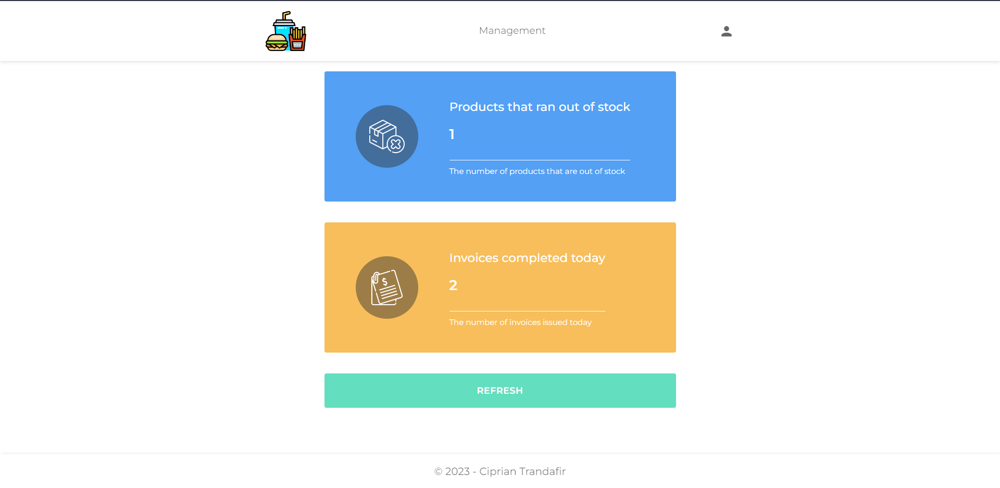

####

**Logs**: grants managers access to view user actions, displaying information based on selected users, date range, and sorting options.

####

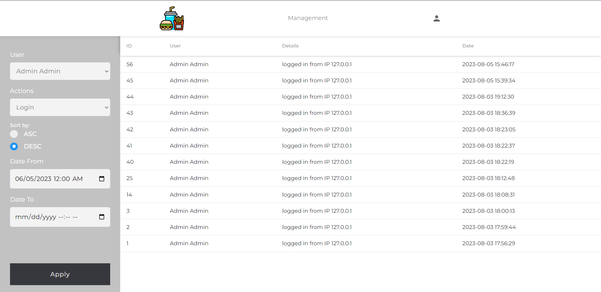

####

**Accounts**: allows managers to view, modify roles, and enable/disable user accounts.

####

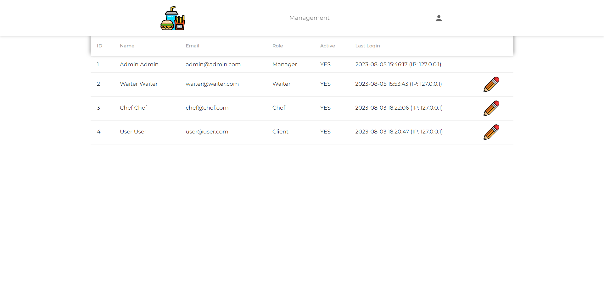

####

**Inventory**: add, update, or remove items. The manager has also possibility to import and export the products list.

####

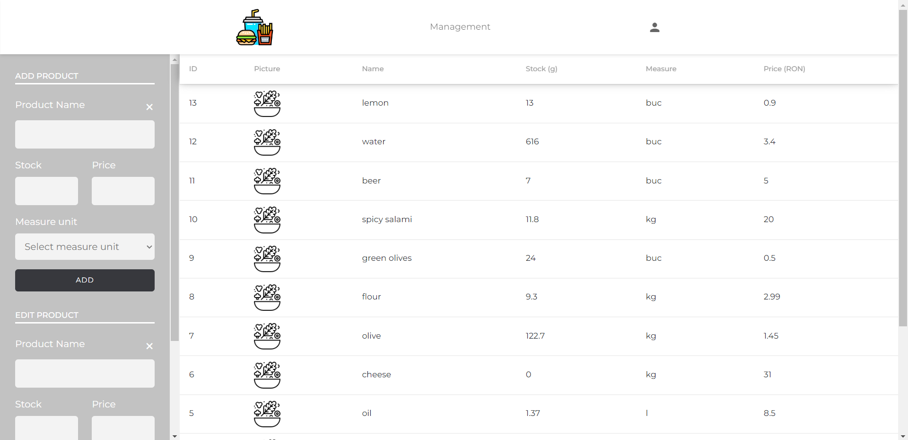

####

**Recipes**: add or update recipes: name, price and ingredients.

####

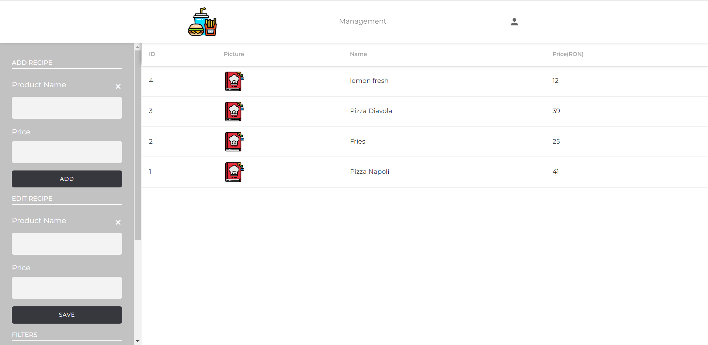

####

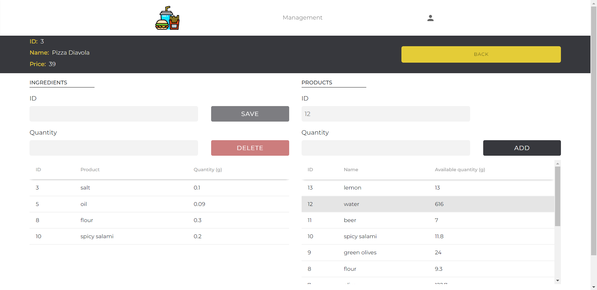

####

**Invoices**: view the invoices list, apply date range filters, and generate graphical insights.

####

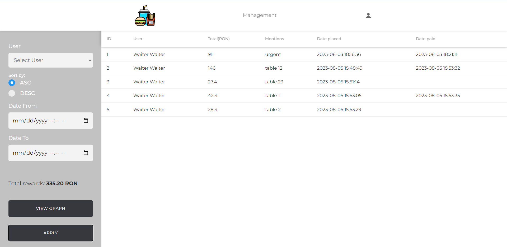

####

### Waiter

Responsible for creating and finalizing invoices.

`Note`: When an invoice contains recipes, kitchen requests are automatically generated for each of these recipes.

**Dashboard**: shortcut to **Create invoice** page, information about pending invoices and kitchen requests.

####

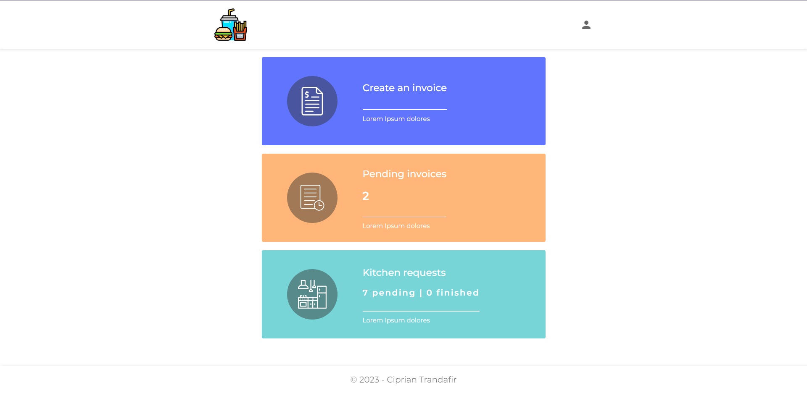

####

**Create invoice**: add recipes and products on the invoice.

####

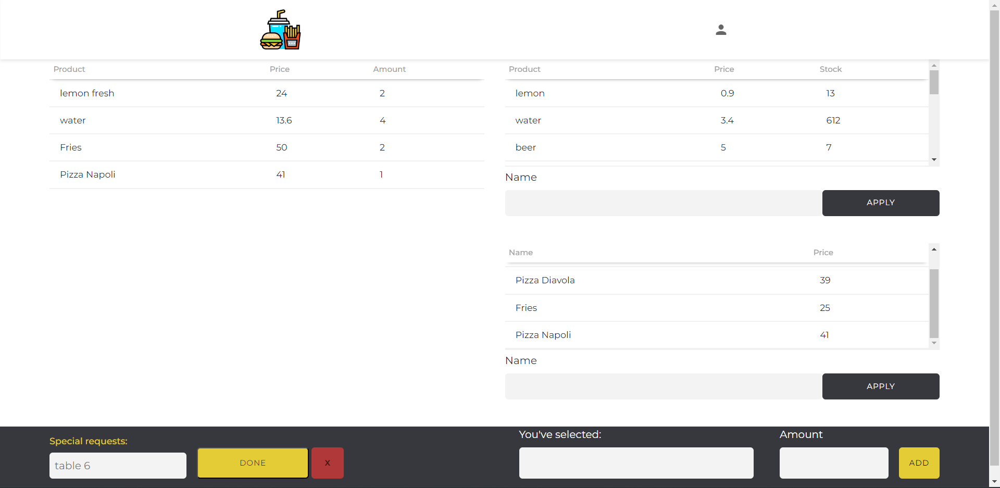

####

**Kitchen requests**: allows waiters to monitor the status of each recipe: **done** or **in progress**.

####

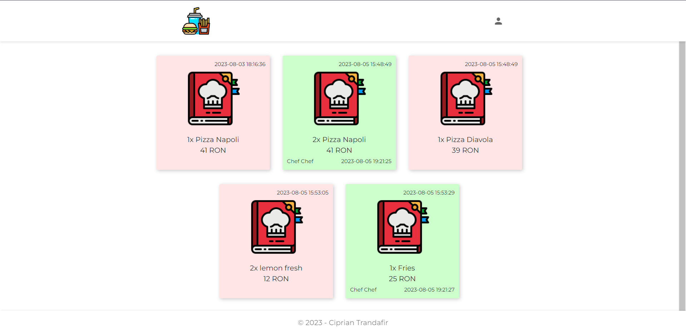

####

### Chef

Respond to waiter recipe requests: view recipes for preparation and mark them as **done**.

####

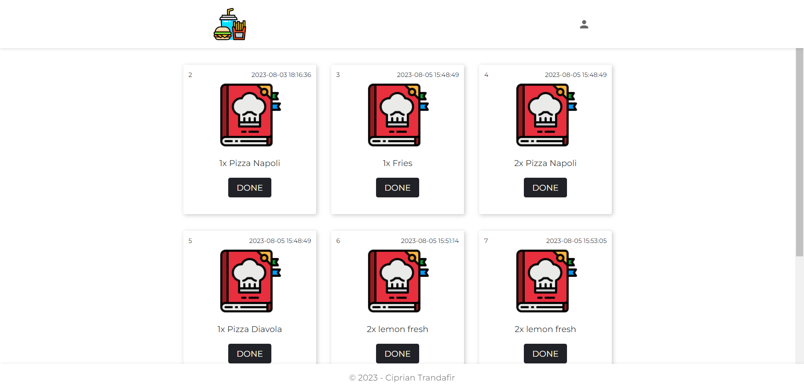

####

### User

Users have limited access and can only view the restaurant's recipes.

####

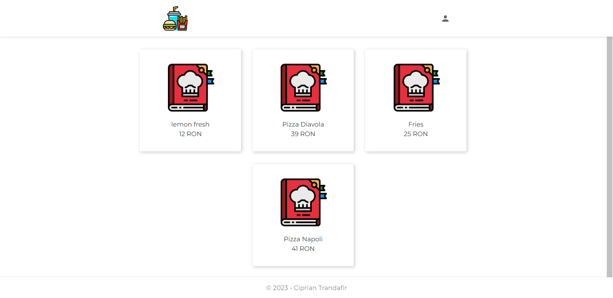

####

### Login and My account pages:

####

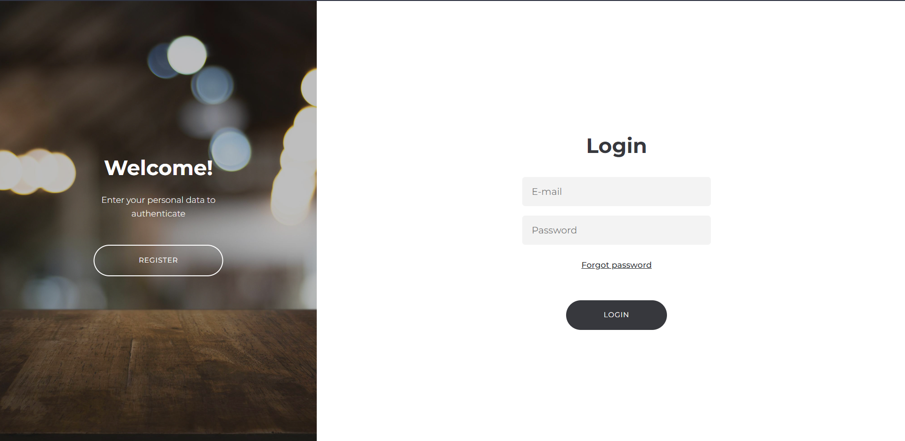

####

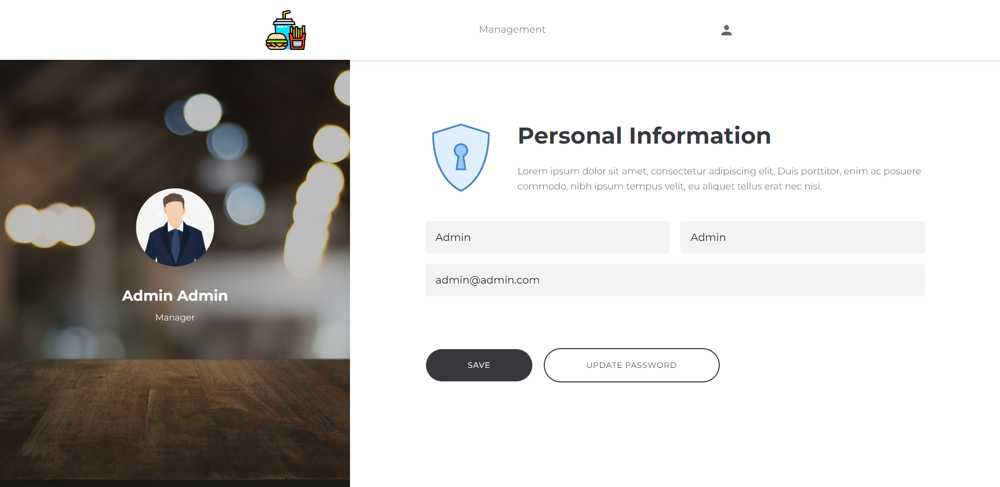

### Database and users login credentials

The repository contains an SQL database file with some demo data.

Below are the login credentials for each user:

1. **Admin**:

   - Email: admin@admin.com
   - Password: admin

2. **Waiter**:

   - Email: waiter@waiter.com
   - Password: waiter

3. **Chef**:

   - Email: chef@chef.com
   - Password: chef

4. **User**:

   - Email: user@user.com
   - Password: user
